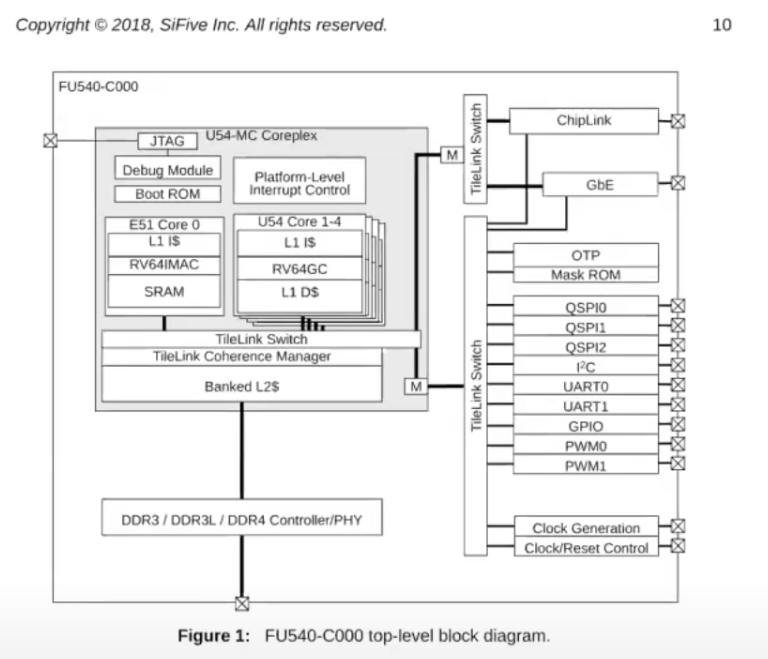

1. Review
  工具程序（shell, echo, find…）—— 操作系统 —— 硬件

2. Isolation
  a. 没有操作系统——==应用程序==直接运行在==硬件资源==上
  b. 操作系统实现：multiplexing和内存隔离
  c. 例子
    i. fork()创建进程，进程对应了CPU；操作系统内核完成不同进程在CPU上的切换，因此应用程序不会直接与CPU交互，而是与进程交互，进程抽象了CPU
      “我们在实验中使用的RISC-V处理器实际上是有4个核。所以你可以同时运行4个进程，一个进程占用一个核。但是假设你有8个应用程序，操作系统会==分时复用==这些CPU核，比如说对于一个进程运行100毫秒，之后内核会停止运行并将那个进程从CPU中卸载，再加载另一个应用程序并再运行100毫秒。通过这种方式使得每一个应用程序都不会连续运行超过100毫秒。”

    ii. exec抽象了内存。传入一个文件名——对应了一个应用程序的内存镜像（指令、数据）；应用程序不能直接访问物理内存（==操作系统的内存隔离==）

    i.e. exec提供了一种方式，让应用程序与内存交互

    iii. files抽象了磁盘。应用程序不能直接读写磁盘本身，只能通过files（可以命名文件，读写文件）

    文件与磁盘中的块对应——实现文件强隔离

    

3. Defensive
  a. 防范恶意的应用程序——应用程序和操作系统之间强隔离
  b. 硬件实现：==user/kernel mode和虚拟内存==

  

4. 硬件支持
  a. user/kernel mode
    i. 处理器有两种操作模式：user mode和kernel mode
    ii. user mode: CPU只能运行普通权限的指令（如add, sub, jrc, branch）
    iii. kernel mode: 特殊权限指令（直接操纵硬件，设置保护）
    iv. 处理器里有一个bit，当它为1是是user mode，为0时是kernel mode；显然，设置bit位的指令必须是特殊权限指令
      “用户程序会通过系统调用来切换到kernel mode。当用户程序执行系统调用，会通过ECALL触发一个软中断（software interrupt），软中断会查询操作系统预先设定的中断向量表，并执行中断向量表中包含的中断处理程序。中断处理程序在内核中，这样就完成了user mode到kernel mode的切换。”

  b. 虚拟内存
    i. ==page table==: 将虚拟内存地址与物理内存地址对应
    ii. 每个进程都有自己独立的page table——每个进程都只能访问出现在自己page table中的物理内存
    iii. 操作系统设置page table，使得每一个进程都有不重合的物理内存——一个进程不能访问其他进程的物理内存

    

5. User/Kernel mode切换
  a. 需要有一种方式能够让应用程序可以将控制权转移给内核（Entering kernel）
    例如ls程序运行时，会调用read/write系统调用，这需要内核提供服务

  b. RISC-V中：ECALL
    i. 接受一个数字参数（代表了用户程序想调用的System Call）
    ii. 跳转到内核中一个特定的位置（系统调用接入点）
    iii. 每一个从应用程序发起的系统调用都会调用syscall函数，syscall函数会检查ECALL的参数，通过这个参数，内核可以知道需要调用的system call
    iv. ==用户的应用程序执行系统调用的唯一方法就是通过ECALL指令==
  c. “学生提问：当应用程序表现的恶意或者就是在一个死循环中，内核是如何夺回控制权限的？
    Frans教授：内核会通过硬件设置一个定时器，定时器到期之后会将控制权限从用户空间转移到内核空间，之后内核就有了控制能力并可以重新调度CPU到另一个进程中。”

  d. C提供了很多对于硬件的控制能力

6. 宏内核 vs 微内核
  a. 可被信任的计算空间（Trusted Computing Base, TSB）
  b. 什么程序应该运行在kernel mode？user/kernel边界
  c. ==宏内核==：让整个操作系统代码都运行在kernel mode
    i. 缺点：不安全。在一个宏内核中，任何一个操作系统的Bug都有可能成为漏洞。因为我们现在在内核中运行了一个巨大的操作系统，出现Bug的可能性更大了。
    ii. 优势：性能。操作系统的子模块（文件系统、虚拟内存、进程管理）现在都位于同一个程序中，它们可以紧密的集成在一起，这样的集成提供很好的性能。
  d. ==微内核==：在kernel mode中运行尽可能少的代码
    i. 内核只有非常少的几个模块，例如，内核通常会有一些IPC的实现或者是Message passing；非常少的虚拟内存的支持，可能只支持了page table；以及分时复用CPU的一些支持。微内核的目的在于将大部分的操作系统运行在内核之外。
    ii. 优势：安全。
    iii. 缺点：只能通过消息来实现某些传统的系统调用
      例如，让shell与文件系统（在user mode）交互：shell通过内核中的IPC系统发送一条信息，内核查看并发现是给文件系统的，然后把消息发给文件系统。文件系统会完成它的工作之后会向IPC系统发送回一条消息说，这是你的exec系统调用的结果，之后IPC系统再将这条消息发送给Shell。

    微内核的的跳转是宏内核的两倍，性能更差

    iv. 大部分桌面操作系统使用宏内核，很多嵌入式系统使用微内核；xv6是一种宏内核设计

    

7. 编译运行kernel
  a. 三部分：==kernel==（包含内核文件），==user==（运行在user mode的程序），==mkfs==
  b. ==Makefile==读取一个C文件（例如proc.c），调用gcc编译器（compiler），生成proc.s（risc-v汇编语言文件）
  c. assembler生成proc.o（汇编语言的二进制格式）
  d. loader收集所有的.o文件，将它们链接（linker）在一起，并生成内核文件（将在QEMU中运行的文件）
  e. 其实以上就是CALL的过程：compiler-assembler-linker-loader
  f. kernel.asm: 包含了内核的完整汇编语言
  g. make qemu: make会读取Makefile文件中的指令，编译文件，然后调用qemu-system-riscv64指令

  

8. QEMU
  a. 
  b. qemu仿真了risc-v处理器
    i. qemu是一个大型的开源C程序
    ii. 主循环只做一件事：
      1) 读取4字节或8字节的risc-v指令
      2) 解析risc-v指令，找出对应的op code
      3) 在软件中执行相应的指令
    iii. 主循环需要维护==寄存器==

    

9. xv6启动过程
  a. 
    

