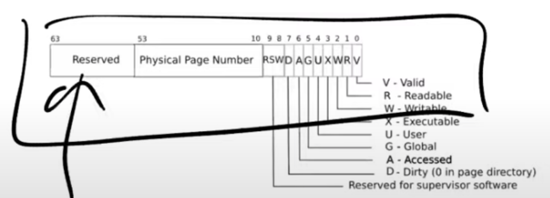

- 强隔离性：每个程序都运行在自己的**地址空间（Adress Spaces）**


##### 页表

- 在硬件中的实现：处理器和内存管理单元（MMU, Memory Management Unit）
- 指令中的地址是**虚拟内存地址**，MMU将其翻译成**物理地址**（使用page table）
- RISC-V上，寄存器SATP会保存page table在物理内存中的地址（page table保存在内存中）
- 每个应用程序都有独立的页表，当OS将CPU从一个程序切换到另一个时，同时也需要切换SATP寄存器中的内容（这是一条特殊权限指令），从而指向新进程的页表；由此，每个程序的指令中相同的虚拟内存地址，被翻译成不同的物理地址

*页表如何工作？*


- 为每个**物理page**创建一个条目，一个page是4kb，即4096bytes
- **虚拟内存地址**划分为：**index**（page的索引，有27bit）和**offset**（在page中查找字节，有12bit，​​​$2^{12}$​​\=4096），这样虚拟内存地址的数量只有​$2^{39}$​个，大约512GB
- 物理内存地址是56bit，所以物理内存最多到​​$2^{56}$​​个；其中44bit是**物理page号**（**PPN**, physical page number），由虚拟内存地址的index翻译而来，剩下12 bit完全复制自虚拟内存地址的offset
- 每个页表最多有​$2^{27}$​个条目（每个条目对应一个page，而page的索引有27bit），这是个很大的数字，如果每个进程都使用已给这么大的页表，内存很快会被页表耗尽

*页表真正的实现方式：多级结构*

- 虚拟内存地址中27bit的index，实际由3个9bit的数字（L2, L1, L0）组成；L2用于索引最高级的**page directory**，directory中的一个条目**PTE(page table entry)**是64bit，共有512个条目（64bits=8bytes, 8\*512=4096bytes）
- SATP寄存器指向最高一级的page diretory的物理内存地址，之后我们用L2索引它，得到一个PPN，它指向了中间级的page directory
- L1用于索引中间级的page directory，接下来到最低级的page directory，用L0索引得到物理内存地址

> 例子：假如地址空间只使用了一个page（4096bytes），需要多少个PTE来映射这一个page？
>   最高级需要一个page directory，其中包含一个数字是0的PTE，指向中间级；中间级也需要一个page directory，也包含一个数字是0的PTE，指向最低级；共需要3个page directory，3\*512个PTE

>   对比前一个方案，一个page需要​$2^{27}$​个PTE，所需空间大大减少


- PTE的低10bit是一堆标志位
  

  - Valid: 1表示PTE合法（上面的例子中，只有第0个PTE合法，其他的设成0）


##### 页表缓存

由页表的**分级结构**知，一个虚拟内存地址的寻址需要读3次内存，代价高；实际中处理器会对最近使用过的虚拟地址的翻译结果有**缓存（TLB, translation lookside buffer）**，其实就是PTE的缓存

切换页表后，TLB会清空


##### 页表的具体工作方式

- 物理地址的结构完全由硬件设计者决定，高于0x80000000的物理地址对应DRAM芯片
- xv6中的映射大多是完全相等的

映射可以是：一对一，一对多，多对一，也可以不映射

> kernel stack在虚拟内存中的地址很靠后，因为在它之下有一个未被映射的**guard page**（它对应的PTE的Valid没有设置）；这样，如果kernel stack耗尽了，它会溢出到guard page，然而由于其Valid位未设置，会立即出发**page fault**（**panic**），我们就知道kernel stack出错了
> guard page不会浪费物理内存

权限：kernel text page被标为**R-X**（可读，可以执行指令，但不可写）；kernel data被标为**RW-**（可写，但不能执行指令，所以X位未设置）**RWX**：R-可读，W-可写，X-可在此执行指令（未设置的位用-代替）


##### kvminit函数：设置好kernel的地址空间

- 为最高级page directory分配物理page
  ```c
  kernel_pagetable=(pagetable_t)kalloc(); //调用kalloc()分配物理page
  memset(kernel_pagetable, 0, PGSIZE); //将这一页内存初始化为0
  ```


- 将每一个**I/O设备**映射到内核
  ```c
  kvmmap(UART0, UART0, PGSIZE, PTE_R|PTE_W) //用kvmmap函数，将UART0映射到内核的地址空间和相同的虚拟地址（前两个参数一致），最后一个参数设置了权限（RW-）
  //之后会继续对VIRTI00， CLINT， PLIC， kernel text， kernel data， TRAMPOLINE进行地址映射
  //最后调用vmprint打印完整的kernel page directory：
  vmprint(kernel_pagetable);
  ```


##### kvminithart函数

- 设置SATP寄存器
  ```c
  w_satp(MAKE_SATP(kernel_pagetable)); //内核告诉MMU来使用刚刚设置好的page table
  ```

  *整个地址翻译从这条指令开始后生效*，i.e.，这条指令之前我们使用的都是物理内存地址，这条指令之后所有的地址都变成了另一个含义：虚拟内存地址

  


