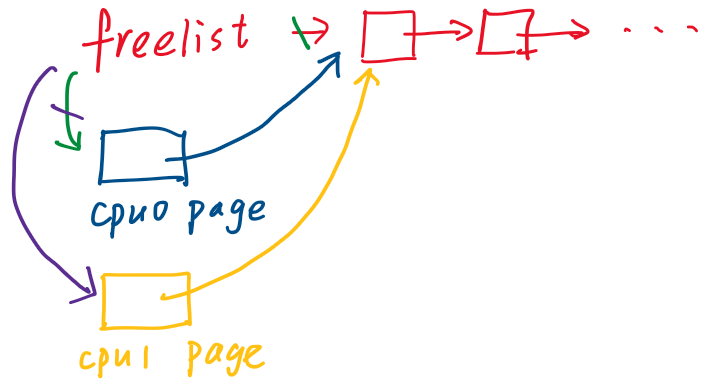

*应用程序使用多个CPU核提升性能*

  *从2000年开始，CPU的始终频率没有增加过——CPU的单线程性能达到了极限*


*多个CPU核可能会* *__并行地__* *访问内核中共享的数据结构（如proc，ticks等）需要锁来协调对于* *__共享数据__* *的更新以确保数据的一致性*

  *如果一份共享数据同时被读写而没有锁，可能会出现**race condition***


*然而，锁使得这些系统调用 __串行__ 执行，反过来又限制了性能。矛盾！*

---

#### 锁如何避免race condition？

e.g. kfree()

```c
acquire(&kmem.lock);
r->next = kmem.freelist;
kmem.freelist = r;
release(&kmem.lock);
```

freelist是一个保存所有空闲page的单链表，kfree函数接收一个物理地址pa作为参数，将它作为单链表新的head节点，并更新freelist指向pa（头插法）

假设CPU0和CPU1都在运行指令，都想释放一个page，则CPU0会将它的page变量r的next指向当前的freelist；CPU1也会完成相同的事情。现在两个物理page对应的r都指向了同一个freelist。

接下来的代码`kmem.freelist=r`会更新freelist为r。由于内存只有一份，所以总是有一个CPU先执行，假设CPU0先执行，那么freelist等于CPU0的变量r，当CPU1再执行时，freelist又等于CPU1的变量r，于是我们丢失了CPU0对应的page



##### 锁的API

**acquire** 接收指向lock的指针作为参数，确保在任何时间，只有一个进程能获取锁

**release** 也接收指向lock的指针作为参数，同一时间尝试获取锁的其他进程需要等待，知道持有锁的进程对锁调用release

**critical section** acquire和release之间的代码，以原子的方式执行共享数据的更新

__锁**序列化**了代码的执行__

*假如内核中只有一把大锁，系统调用的流程为：一个系统调用获取到big lock，完成自己的操作，释放这个big lock，之后下一个系统调用才能执行，变成了串行执行*

操作系统有多把锁——并发执行

---

#### 什么时候使用锁

*锁限制了并发性和性能，因此不能滥用*

规则：如果超过一个进程访问了一个**共享的数据结构**，并且其中一个进程会更新它，那么就需要对这个共享的数据结构加锁

有时太过严格——lock-free program，不加锁也能正常工作

有时太过宽松——一些其他场合也需要锁（e.x.，如果我们将一个字符串传递给printf，它应该原子性地将整个字符串输出，而不是与其他进程的printf交织输出）

---

#### 锁的特性

三个作用

- 避免丢失更新（如上面kfree的例子）
- 打包多个操作，使它们在critial section里具有原子性
- 维护共享数据结构的不变性

缺点：**死锁（Deadlock）**

- 首先acquire一个锁——在critial section里又acquire同一个锁——然而第二个acquire必须等第一个被release以后才能继续执行——但不继续执行就走不到第一个release——程序卡在这里
- xv6会探测这样的死锁：如果看到同一个进程多次acquire同一个锁，会触发panic
- 如果有多个锁：e.g.，CPU1执行rename将文件从d1移到d2，CPU2执行rename将文件从d2移到d1。CPU1先获取d1的锁，CPU2同时也会获取d2的锁；之后CPU1需要获取d2的锁，但必须等待d2的锁（CPU2持有）释放，而CPU2也在等待CPU1释放d1的锁——**deadly embrace**，这样的死锁很难被探测
- 解决方案：对多个锁**排序**，所有操作必须以相同的顺序获取锁

然而定义一个全局的锁的顺序，也存在问题：

- e.g.，一个模块m1中方法g调用了另一个模块m2中的方法f，那么它需要知道方法f使用了哪些锁，并集合f和g的锁形成一个全局的锁的排序
- 这意味着模块m2中的锁必须对m1可见——违背了**代码抽象**的原则

---

#### 锁与性能

前面提到，操作系统需要多把锁，以保证**并发性**

即需要将数据结构和锁进行**拆分**

良好的性能——大量的工作

---

#### xv6中UART模块对锁的使用

UART只有一个锁（coarse-grained lock）

- 锁保护数据结构的特性不变
  - uartputc函数：先acquire锁——查看buffer是否有空槽位，如果有则写，并更新写指针，调用uartstart——最后release锁
  - uartstart函数：锁（在uartputc中获取的）确保了可以在下一个字符写入buffer之前，处理完buffer中的字符

- 锁确保了THR（Transmission Holding Register）在一个时间上只有一个写入者
  - UART硬件完成传输，产生一个中断——在中断处理函数uartintr中获取锁


---

#### 自旋锁（Spin lock）的实现

##### acquire接口

一个有问题的实现：

- 一个死循环，判断锁对象的locked字段是否为0（0表示当前锁没有持有者，当前对于acquire的调用可以获取锁）
- 设置locked字段为1，返回
- locked字段不为0，则程序一直“spin”，直到锁的持有者调用release将locked设为0

问题：两个进程可能**同时读到**锁的locked字段为0——**race condition**，这样它们都获取了锁

正确的实现（依赖于一个硬件指令）：

**amoswap（atomic memory swap）**

- 接收三个参数：address，寄存器r1，寄存器r2
- 先锁定住address，将address中的数据保存在临时变量tmp中
- 将r1中的数据写入address
- 将保存在tmp中的数据写入r2
- 最后对address解锁

##### 用这个原子指令实现自旋锁

- acquire
  - while循环（test-and-set循环），有一个\_sync\_lock\_test\_and\_set函数
  - 函数将1写入locked字段，并返回locked字段之前的数值
  - 返回0——没有人持有锁，循环结束；返回1——锁被持有，循环继续，直至locked字段被设置回0

- release
  也是atomic swap，将0写入locked字段


*为什么release中不直接用store？*

store不是原子操作！可能有多个CPU使用store向locked字段写入数据

这里相当于直接利用RISC-V提供的**原子性指令**完成对locked字段的更改，把软件锁转化为了硬件锁来实现

细节：

- acquire函数的开始，关闭了中断
  否则，uartputc函数会acquire buffer的锁，在critical section中UART传输了字符，产生一个中断；uartintr来处理中断，而它需要获取同一把锁，然而此时这把锁被uartputc持有——uartintr一直等待uartputc释放锁，然而程序停止执行的话，uartputc走不到release——**死锁**！


- memory orerding
  e.g.，先将locked字段设置为1来acquire锁——对x加1——再将locked字段设置为0来release锁

    编译器可能重排指令以获得更好的性能：将x的加1移到locked置0之后

    不会影响指令流的正确性：x和锁**完全相互独立**，仍然按照串行执行

  然而对于**并发**执行，将是灾难

  因此，使用**synchronize指令**，确定指令的移动范围（它告诉编译器，不能把在它之前的load / store指令移到它之后，锁的acquire和release都包含了synchronize指令）

  


