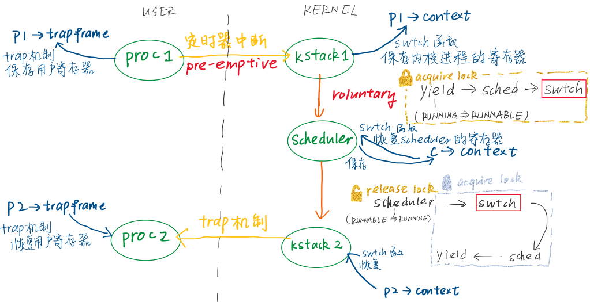

#### 线程概述

分时复用

- 分时复用
- 简化程序结构
- 并行运算，提高处理速度

**线程** 一种在有多个任务时简化编程的抽象；串行执行代码的单元

线程的状态：程序计数器（当前线程执行指令的位置），寄存器，Stack

多线程并行运行的两个策略：

- 在多核处理器上使用多个CPU，每个运行一个线程
- 一个CPU在多个线程之间来回切换；因此，线程数通常远多于CPU核数

不同线程系统的主要区别：线程之间是否共享内存？

- 一种，多个线程在同一个地址空间内运行，并且可以看到彼此的更新（需要用到锁）
- 另一种，每一个用户进程都有独立的内存地址空间，并包含一个线程，它控制了用户进程代码指令的执行
- 更复杂的系统中，允许一个用户进程中包含多个进程，这样进程中的多个线程共享进程的地址空间

---

实现线程系统的挑战：

- 线程间的切换。停止一个线程并启动另一个线程的过程称为**线程调度（Scheduling）**，xv6为每个CPU核都创建了一个线程调度器
- 切换时保存原线程的哪些信息？在哪里保存？
- 处理**运算密集型线程（compute bound thread）**

#### xv6线程调度

##### 处理运算密集型线程

**定时器中断**（每个CPU核上都有一个定时产生中断的硬件设备） 将程序运行的控制权从__用户空间代码__切换到__内核__中的中断处理程序——中断处理程序自愿将CPU**出让（yield）**给线程调度器，并告知其可以让一些其他线程运行

**pre-emptive scheduling** 即使用户代码本身没有出让CPU，定时器中断仍然会将CPU的控制权拿走，并出让给线程调度器

另一种是**voluntary scheduling**

线程调度的实现：

- pre-emptive scheduling：定时器中断强制将CPU控制权从用户进程转给内核
- voluntary scheduling：内核中用户进程对应的内核线程代表用户进程出让CPU

一些线程状态：RUNNING（正在某个CPU上运行），RUNABLE（还没有在某个CPU上运行，但是一旦有空闲的CPU就可以运行），SLEEPING（线程在等待一些I / O事件）

  RUNNING：程序计数器和寄存器位于正在运行它的CPU硬件中

  RUNABLE：当它从RUNNING变成RUNABLE时，需要将它位于CPU的状态拷贝到内存的某个位置

线程调度器决定云心过一个RUNABLE线程时，需要将保存的程序计数器和寄存器拷贝回调度器对应的CPU中

---

#### xv6线程切换

回顾：程序执行时因为系统调用或响应中断而走到内核中，相应的用户空间状态被保存在程序的**trapframe**中，同时属于这个用户程序的内核线程被激活，处理完成后trapframe中保存的用户进程状态被恢复

响应定时器中断：内核中第一个进程的内核线程被切换到第二个进程的内核线程，再从第二个进程的内核线程中返回用户空间的第二个进程（同样通过trapframe）

e.g.，从CC程序的内核线程切换到ls程序的内核进程：

- 首先将CC程序的内核线程的内核寄存器保存在一个**context对象**中
- ls程序的状态必然是**RUNABLE**，意味着ls程序的用户空间状态已经保存在对应的trapframe中；以及，ls寄存器的内核线程对应的内核寄存器也已经保存在对应的context对象中（当它上一次从RUNNING被切换成RUNABLE的时候）。接下来，恢复ls程序的内核线程的context对象
- ls继续在它的内核线程stack上，完成它的中断处理程序
- 恢复ls程序中的trapframe中的用户进程状态，返回到用户空间的ls程序

核心点：

- 从**第一个用户进程**接入内核：保存用户进程的状态，并运行**第一个用户进程的内核线程**
- 从第一个用户进程的内核线程切换到**第二个用户进程的内核线程**
- 第二个用户进程的内核线程恢复**第二个用户进程**的用户寄存器，返回第二个用户进程

---

#### 实际的切换流程

假设：进程P1正在运行，进程P2是RUNABLE；有两个CPU核

- 定时器中断——强迫CPU从用户空间进程切换到内核——trampoline代码将用户寄存器保存于trapframe
- 内核运行usertrap执行相应的中断处理程序（CPU在进程P1的内核线程）
- 进程P1的内核线程决定出让CPU，（做很多工作），调用**swtch函数**
- **swtch函数**保存进程P1对应的内核线程的寄存器至context对象，切换到当前CPU对应的**调度器线程**，在它的context下执行scheduler函数
- **scheduler函数**将进程P1设为RUNABLE——通过进程表单找下一个RUNABLE进程——再次调用swtch函数
- **swtch函数**完成以下步骤
  - 保存调度器线程的寄存器到context对象
  - 恢复进程P2的context中保存的寄存器
  - 进程P2在上一次进入RUNABLE状态之前，必然也调用了swtch函数，于是恢复之前的swtch函数（它一定是在系统调用或中断处理程序中），返回进程P2所在的系统调用或中断处理程序中
  - P2的内核程序执行完，恢复trapframe中的用户寄存器，恢复用户进程P2

每个内核线程都有context对象：用户进程对应的内核线程，context对象保存在用户进程对应的procg结构体中；调度器线程的context对象保存在cpu结构体中（每个cpu结构体对应一个CPU核）

**context switching** 从一个线程切换到另一个线程

---

#### yield函数

线程切换的第一步

- 获取进程的锁
- 将进程状态改为RUNABLE（上一步获取锁的目的就是让这个状态对其他CPU的调度器线程不可见）
- 调用sched函数

---

#### sched函数

- 合理性检查，遇到异常就panic
- 调用swtch函数

---

#### swtch函数

- 第一个参数是`p->context`（当前进程的context），第二个参数是`c->context`（当前CPU的context）
- 将当前内核进程的寄存器保存到`p->context`，从`c->context`恢复当前CPU核的调度器线程的寄存器

*当前进程的内核进程→调度器线程*

- ra寄存器指向scheduler函数（因为恢复了调度器线程的context对象中的内容），ret以后返回调度器线程

---

#### scheduler函数

- 清空对当前进程的记录：`c->proc=0`
- 之前在yield函数中获取了进程的锁，现在已经完成了切换，于是释放锁
  *p->lock的作用*

  - *确保了出让CPU过程的****原子性**** 出让CPU涉及三个步骤：将进程状态从RUNNING改成RUNABLE；将进程的寄存器保存在context对象中；停止使用当前进程的栈。锁可以在这三个步骤完成前阻止其他调度器线程看到当前进程。*
- *确保了进程启动过程的**原子性** 假如进程的状态已经设为RUNNING，但还没有从context恢复所有寄存器，此时发生了中断……锁可以在进程启动的过程中关闭中断*

- 检查所有进程，找到一个RUNNABLE的来运行
- 获取进程的锁，开始切换进程
  - 状态改成RUNNING
  - 调用swtch函数保存调度器线程的寄存器，并恢复目标进程的内核线程的寄存器

*调度器线程→目标进程的内核线程*

- swtch函数会返回sched函数（将要切换到的进程上一次被挂起时，是从sched函数调用了swtch函数）
  *注意：调度器线程调用了swtch函数，但从swtch函数返回时，是返回到目标进程在很久之前对swtch的调用，因为已经切换到目标进程的内核线程了*

  *这是线程切换的核心*

