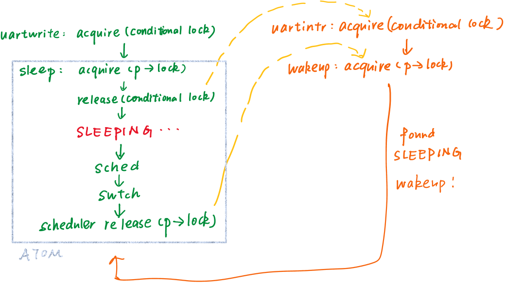
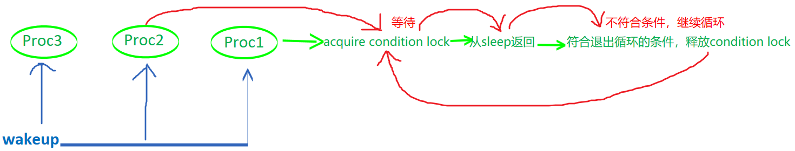

#### 上节回顾：线程切换中锁的限制

1. 线程切换过程中需要一直持有p->lock
- 进程调用yield函数，获取自己的**锁**，将自己的状态从RUNNING改成RUNNABLE
  *获取锁的目的：阻止其他CPU核的调度器线程在当前进程完成切换前，发现进程是RUNNABLE并运行它（每一个CPU核的调度器线程都在遍历进程表单），两个CPU核使用同一个栈运行同一个线程会使系统立即崩溃*


- 调用sched函数，在sched函数中再调用swtch函数，swtch函数将**当前线程**切换到**调度器线程**
- （调度器线程之前调用过swtch函数，以切换到新进程的内核线程）从调度器线程的swtch函数返回
- 返回后，调度器线程释放**锁**
2. 进程在调用swtch函数时，必须持有p->lock，但**不能持有其他任何锁**

*e.g.，假如P1的内核线程持有其他锁（可能是在使用磁盘，UART，console过程中持有的），而它出让了CPU，调度器线程切换到P2。假如P2也想使用磁盘，UART或condole，它会对P1持有的锁调用acquire，陷入死循环——**dead lock***

sched函数中的检查代码会确保除了p->lock以外，线程不持有其他锁


---

#### Sleep & Wakeup接口

*有些场景需要****等待****特定事件：正在从pipe中读数据，但pipe当前没有数据——等待pipe非空的事件；正在读取磁盘——等待读磁盘结束的事件；wait函数——等待子进程退出的事件*

直观方法：通过循环实现**busy-wait**

```c
while pipe buf is empty{
}
```

适用于：要等待的事件极有可能在0.1微秒内发生

*但如果事件需要数个微秒，或甚至不知道要多久才发生，一直循环便浪费时间；可以通过类似swtch函数调用的方式出让CPU，并在事件发生时重新获取CPU*

*e.g.，shell需要输出时调用write系统调用，最终走到uartwrite函数，它在循环中将buf中的字符一个一个地向UART硬件写入，两个字符之间的等待时间很长*

- UART硬件完成传输一个字符后，触发一个**中断**
- 中断处理程序uartintr读取UART对应的memory mapped register，检查其中表明传输完成的**LSR_TX_IDLE标志位**，如果为1，将tx_done设为1，并调用**wakeup**函数
- **wakeup**函数使uartwrite中的**sleep**函数恢复执行，并尝试发送一个新字符
  注：wakeup函数和sleeph函数通过**sleep channel**参数链接在一起，所以wakeup函数只会唤醒特定的sleep函数


---

#### Lost wakeup

*假如sleep只接收sleep channel作为唯一参数，它其实不能正常工作——**broken_sleep***

*还是上面的例子，对buf中每一个字符检查done标志位，为0则调用sleep函数并传入tx_channel，之后将字符传给UART，UART触发中断，中断处理函数首先将done标志位设为1，并调用wakeup*

*这里uartwrite和uartintr有共享的数据——done标志位，都需要访问UART硬件，因此需要**锁**来coordinate*


*在哪里加锁？*

中断处理程序中：最开始加锁，最后解锁

uartwrite？

- 一种可能：发送一个字符的过程中持有锁——肯定不能工作！
  *uartwrite的“while not done”循环在等待发送完成，但我们对整个代码段加锁，导致中断处理程序不能获取锁，也就无法将done改为1，这个循环一直持续下去*

  注：用while调用sleep的原因是，“你或许被唤醒了，但其他人将你等待的事件拿走了，所以你还得继续sleep”


- 另：传输字符的最开始获取锁（保护共享变量done），但调用sleep函数之前释放锁
  问题：一旦释放锁，当前CPU的中断被重新打开，中断处理程序uartintr立刻获取锁，将done设成1，最后调用wakeup函数。然而此时__写线程还位于release和sleep之间__，还未进入SLEEPING状态；所以wakeup没有唤醒任何进程。之后写线程继续执行，进入SLEEPING状态，但wakeup已经发生过，没有人再唤醒它——**lost wakeup**

  


---

#### 避免Lost wakeup

把锁作为参数传给sleep，sleep把释放锁核设置进程为SLEEPING合并成一个**原子操作**，这样wakeup不可能看到锁被释放然而还未SLEEPING的场景

  把锁作为参数传给sleep，sleep把释放锁核设置进程为SLEEPING合并成一个**原子操作**，这样wakeup不可能看到锁被释放然而还未SLEEPING的场景


##### wakeup函数

一个参数：channel

- 查看整个进程表单，对于每个进程首先加锁
- 如果进程是SLEEPING且channel相符，将进程状态设为RUNNABLE
- 释放锁

##### sleep函数

两个参数：channel和需要被释放的锁（conditional lock）

- 先获取此进程的锁（由上面的wakeup知，它唤醒进程的前提是获取进程的锁，这里先获取锁，让wakeup不能获取锁）
- 释放conditional lock（此时中断处理程序可以获取conditional lock，wakeup可以被调用，然而它没有进程的锁，无法查看进程状态）
- 将进程状态设为SLEEPING，记录sleep channel，再调用sched函数——swtch函数——调度器线程释放p->lock
- wakeup终于获取p->lock，发现它在SLEEPING，唤醒它



---

#### Pipe中的sleep & wakeup

piperead函数中，pi->lock用于保护pipe

piperead函数调用sleep函数等待的**condition**是pipe中有数据（pi->nwrite > pi->nread，写入pipe的字节数大于被读取的字节数）

pi->lock作为**condition lock**被传给sleep，以确保不出现**lost wakeup**

  可能出现lost wakeup的原因：不同的CPU核上有另一个线程刚刚调用了pipewrite，它向pipe的缓存写数据，最后在piperead所等待的sleep channel上调用wakeup，此时piperead尚未进入SLEEPING，进而产生lost wakeup


在while循环里调用sleep的原因：

- 可能有多个进程在读取同一个pipe
- 如果有一个进程向pipe中写入一个字节，它会调用wakeup，唤醒所有在读同一个pipe的进程
- 但总是有一个进程**首先被唤醒**，而pipe中只有一个字节，所以[其他进程需要继续sleep](onenote:#Lec13%20Sleep%20%20Wake%20up&section-id={7EB9EBCE-898C-462A-BBF8-2771E8E465C5}&page-id={26DD90CC-871E-4EB9-AF01-D5D392E548A3}&object-id={599DDAD9-CE54-027E-009E-F43722E6AF54}&8E&base-path=https://d.docs.live.net/1f65032c09a11ca3/Documents/yuebaitu%20的笔记本/4各学科/3CS/玥自学/操作系统/lecture%20notes.one)
  注：sleep函数中首先对condition lock解锁，但返回时又会**对condition lock重新上锁**，这样第一个被唤醒的线程会持有condition lock，而其他线程想要从sleep函数返回就必须acquire这个condition lock，所以在此等待


- 这个幸运的线程从sleep函数返回，检查发现pi->nwrite > pi->nread，于是从循环退出，并读取一个字节，最后piperead**释放condition lock**
- 接下来，第二个进程被唤醒，它的sleep函数可以acquire condition lock并返回，但是通过检查发现pi->nwrite == pi->nread（因为pipe中唯一的字节被读走了），所以会继续循环（循环条件就是pi->nwrite == pi->nread），也就又进入sleep
- 由此可见，几乎所有**对sleep的调用都需要包装在一个循环中，从sleep返回后可以检查condition是否符合，不符则继续循环，重新sleep**




总结：sleep和wakeup的规则复杂，因为**需要向sleep展示等待的condition**（需要传入condition lock）；但sleep和wakeup足够灵活，因为它们只需要一个condition lock，**不需要理解这个condition**

---

#### exit系统调用

两大问题

- 不能单方面摧毁一个线程：它可能在另一个CPU上运行，使用着自己的栈；可能正在内核中持有锁；可能正在更新一个复杂的内核数据
- 即使线程决定自己退出，它仍然持有一些资源：它的栈，它在进程表单中的位置；当它还在执行代码时，就**不能释放正在使用的资源**

##### exit

- 关闭所有已打开的文件
- 释放进程的cwd（current working directory）给文件系统
- 将子进程（如果有的话）的父进程设为init进程（pid=1）
  每一个正在exit的子进程，都有一个父进程中的对应的**wait系统调用**，它会完成进程退出的最后几个步骤；如果父进程退出，则子进程不再有父进程，它们要退出时就没有对应的父进程的wait；因此重新指定子进程的父进程为init进程


- 调用wakeup唤醒当前进程的父进程（它可能在wait()）
- 将进程的状态设为ZOMBIE
- 调用sched，进入调度器线程（调度器只会运行RUNNABLE进程，当前进程是ZOMBIE，所以调度器不会运行它，这个sched永远不会返回到当前进程）

---

#### wait系统调用

包含一个大循环，扫描进程表单，寻找child

- 找到父进程是自己，且状态是ZOMBIE的进程（这些进程在exit函数中几乎要执行完了）
- 调用freeproc函数，完成**释放这些子进程资源**的最后几步（释放trapframe，page table等等），最后将子进程的状态设为**unused**（之后fork系统调用就可以重新利用进程在进程表单的位置）

wait不仅让父进程方便地知道了子进程的退出，而且**是进程退出的重要组成部分**，释放了运行子进程所需的资源，这些资源如果[让子进程的exit自己释放](onenote:#Lec13%20Sleep%20%20Wake%20up&section-id={7EB9EBCE-898C-462A-BBF8-2771E8E465C5}&page-id={26DD90CC-871E-4EB9-AF01-D5D392E548A3}&object-id={A51C867A-CEA0-0187-2919-0F494AA086E9}&3A&base-path=https://d.docs.live.net/1f65032c09a11ca3/Documents/yuebaitu%20的笔记本/4各学科/3CS/玥自学/操作系统/lecture%20notes.one)将会非常麻烦

---

#### kill系统调用

[kill不能直接停止目标进程的运行](onenote:#Lec13%20Sleep%20%20Wake%20up&section-id={7EB9EBCE-898C-462A-BBF8-2771E8E465C5}&page-id={26DD90CC-871E-4EB9-AF01-D5D392E548A3}&object-id={96912853-15B6-0435-070E-F95D495D4274}&95&base-path=https://d.docs.live.net/1f65032c09a11ca3/Documents/yuebaitu%20的笔记本/4各学科/3CS/玥自学/操作系统/lecture%20notes.one)

- 扫描进程表单，找到目标进程，**将p->killed设为1**
- 如果进程在SLEEPING，设为RUNNABLE

*kill系统调用很温和，基本上没做什么事*

##### usertrap函数

- 在执行系统调用之前（`r\_scaurse()==9`），如果`p->killed==1`，进程自己调用exit（此时进程尚未执行系统调用，并未持有任何锁，所以exit安全）
- usertrap函数最后，进程再次检查自己是否被kill，如果是则调用exit退出

*由此可见，kill系统调用并非真正停止进程运行，而是：如果进程在用户空间，则它下一次执行系统调用时退出；如果进程正在执行用户代码，则下一次中断发生时退出。**从调用kill到进程真正退出存在明显的延时***

*然而，如果进程在SLEEPING状态下被kill，通常它会实际地退出，机制如下：*

调度器会重新运行进程（[它被kill设成RUNNABLE了](onenote:#Lec13%20Sleep%20%20Wake%20up&section-id={7EB9EBCE-898C-462A-BBF8-2771E8E465C5}&page-id={26DD90CC-871E-4EB9-AF01-D5D392E548A3}&object-id={2303D1D8-46C6-0CFC-3826-D5E3F337ABB2}&40&base-path=https://d.docs.live.net/1f65032c09a11ca3/Documents/yuebaitu%20的笔记本/4各学科/3CS/玥自学/操作系统/lecture%20notes.one)），[**包装了sleep的循环**](onenote:#Lec13%20Sleep%20%20Wake%20up&section-id={7EB9EBCE-898C-462A-BBF8-2771E8E465C5}&page-id={26DD90CC-871E-4EB9-AF01-D5D392E548A3}&object-id={1FB154E1-45F6-0B94-0124-AFE809332E29}&B0&base-path=https://d.docs.live.net/1f65032c09a11ca3/Documents/yuebaitu%20的笔记本/4各学科/3CS/玥自学/操作系统/lecture%20notes.one)**会检查进程的killed标志位**，然后调用exit

*也有不能直接退出的情况：e.g.，一个进程在更新文件系统，创建一个文件的过程中，不适宜直接退出，所以磁盘驱动中的sleep循环不会检查killed标志位*

**init进程不允许退出**，exit的最开始会检查，如果调用exit的是init进程，将触发panic


