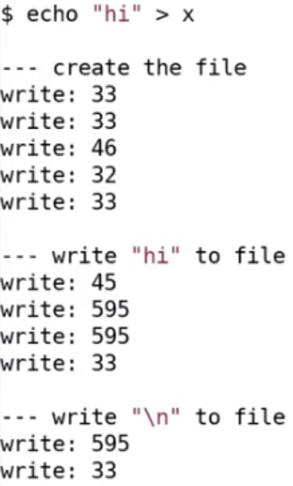

特性：有层级的路径；文件可命名；持久化

机制：对硬件的抽象；crash safety； 如何在磁盘上排布（数据结构），性能

---

#### 实现概述

相关的系统调用：open，write，link（为文件创建另一个名字），unlink（删除特定的文件名）

文件描述符必然与某个对象（inode）相关联，**不依赖文件名**

##### 结构

**inode** 代表一个文件的对象，不依赖文件名

- 文件系统通过一个整数来引用inode
- 有link count跟踪文件名的数量，openfd count计数打开了文件的文件描述符；只有这两个计数器都为0时才能删除文件

**file descriptor** 需要自己维护对于文件的offset（write和read都没有offset参数）

__磁盘——buffer cache——logging层（保证持久性）——inode——文件名，和文件描述符操作__

---

#### 存储设备

SSD & HDD

**sector** 磁盘驱动可以读写的最小单元（过去通常是512字节）

**block** 一个block对应一个或多个sector

存储设备和CPU、内存都连接在电脑总线上；文件系统运行在CPU上，将内部数据存储在内存，同时也以读写block的形式存储在SSD或HDD

文件系统**对硬件的抽象**屏蔽了SSD和HDD的工作方式的差异

##### xv6的布局结构

block0：没用，或作为**boot sector**（包含了操作系统启动的代码）用于启动操作系统

block1：**super block**，描述了文件系统（存储了信息）

block2~block32：log

*——metadata block——*

block32~block45：存储inode（一个inode是64bytes，所以多个inode会打包存在一个block里）

  inode对应的__block = 32 + (inode++) \* 64 / 1024__

bitmap block：记录数据block是否空闲

数据block：存储文件的内容和目录

---

#### inode

- **type字段** 表明inode是文件还是目录
- **nlink字段** link计数器
- **size字段** 文件数据的字节数
- 12个**direct block number** 指向构成文件的前12个block
- **indirect block number **这个block包含了256个block number，这256个block包含文件的数据

*最大的文件尺寸：（12+256）\* 1024 bytes = 268KB*

*扩展inode中indirect block number以扩展文件大小*

  类似page table，构建**双重indirect block number**

  indirect block number指向一个block——包含256个indirect block number——每一个指向包含256个block number的block

  __256 \* 256 \* 1K__

e.g.，读取文件的第8000个字节

- 除以1024（block的大小），≈7——说明在direct block number中
- 对1024求余，得到block中对应的位置

##### 目录

每个目录包含了**directory entries**，每条entry有固定格式：

- 前2个字节包含目录中文件或子目录的**inode编号**
- 接下来的14个字节包含文件名或子目录名

路径名查找

  e.g.，查找”/y/x“

  - 从root inode（编号为1，在block32的64~128字节）开始
- 扫描root inode包含的所有block，找到“y”
- 目录y也有inode编号，继续找到文件x对应的inode，返回

实例：

||write 33 : 分配的inode在block 33，将inode中的type字段改成文件 write 33 : 向inode写入其他内容 write 46 : 向block46（第1个data block）写数据（它属于根目录，我们正在向根目录创建一个新文件，因此要增加一个entry） write 32 : 向根目录的inode中写数据（改变size字段，因为增加了一个entry） write 33 : 再次更新文件x的inode  write 45 : 更新bitmap（扫描，找到一个尚未使用的data block，更新其bit） 两次write 595 : 挑选了data block 595，调用两次是因为写入了两个字符 write 33 : 更新inode的size字段（文件有了两个字符）；更新第一个direct block number （595）  write 595 : 写入换行符 write 33 : 同上面的write 33|
|-------------------------|------------------------------------------------------------------------------------------------------------------------------------------------------------------------------------------------------------------------------------------------------------------------------------------------------------------------------------------------------------------------------------------------------------------------------------------------------------------------------|

---

#### 创建inode的代码

- **sys_open函数** 调用create函数
- **create函数** 解析路径名，找到最后一个目录，查看文件是否存在（如果存在就返回错误），之后调用ialloc（inode allocate）
- **ialloc函数** 遍历所有可能的inode编号，找到inode所在的block，检查type字段，如果空闲则设为文件

*如果多个进程同时调用create函数？*

*两层锁：bcache——保护buffer cache的内部数据；sleep lock——保护单个block cache*

- **bread函数** 调用bget函数
- **bget函数** 获取bache的**锁**并扫描**buffer cache**，查找block number是否在cache中，是则将引用计数加1，再释放bcache的锁

*block cache使用sleep lock，通过sleep将CPU出让*

- **sleep lock** aquiresleep函数先获取spinlock，然后进入sleep状态
- **brelease函数** 释放sleep lock，之后获取bcache的锁，减少block cache的引用计数；若引用计数为0，将block cache移到buffer cache链表的头部（表明它是最近使用过的，当bget找不到block cache时，需要通过LRU replacement来腾出空间存放新的block cache，那么直接更新buffer cache的tail）

*buffer cache必须维持的特性：一个block只有一份缓存*

