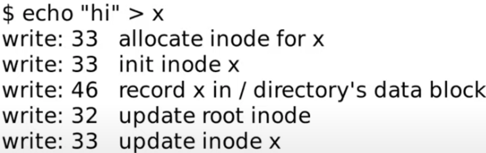
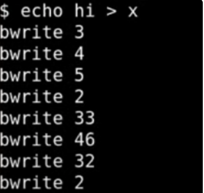

||内存数据保存在RAM中——全部丢失（进程数据、文件描述符） 磁盘的数据存活 先写了block 33表明inode已被使用，电力故障导致丢失了刚刚分配的inode，于是inode虽然被标记为已分配，但没有出现在任何目录，也没办法删除 如果调整顺序：先更新目录内容，再处理inode 则当我们读文件时，是在读一个未分配的inode|
|-------------------------|-------------------------------------------------------------------------------------------------------------------------------------------------------------------------------|

*问题不在于操作顺序，而是有多个操作，必须打包成****原子操作***

---

#### logging

- 确保文件系统系统调用的**原子性**
- 支持**快速恢复**
- 高效

基本思想：将磁盘分为两部分——**log**和文件系统，文件系统比log大得多

**log write** 更新文件系统时，将数据写入log，而非直接更新文件系统

**commit op** 当文件系统的操作全部结束，commit文件的操作（log要记录属于某个文件的操作数）

**install op** 将block从log分区移到文件系统分区（idempotence操作，执行多次和一次效果一样）

**clean op** 清除log（将该文件的操作数设为0）

##### log的结构

- **header block**包含有效的log block数量、每个log block实际对应的block编号（即commit record）
- 之后都是**log block**，包含每个block的数据

---

#### log\_write函数

*每个文件系统操作，都有****begin\_op****和****end\_op****表明****事务（transaction）****的开始 & 结束（保证所有写block操作具有****原子性****）*

- 先获取log header的锁
- 更新log header ：查看要写的block是否已经被log记录了，是则**log absorbtion**（忽略），否则将其记录在列表最后
- 调用bpin函数将此block固定在block cache

---

#### end\_op函数

- 调用**commit**函数
  - **write\_log**将内存中的log header中的block编号对应的block，从block cache拷贝到磁盘的log区域
    - 遍历log中记录的block：读出block——将cache中的block拷贝到log block——将log block写入磁盘
  - **write\_head**将内存中的log header写入磁盘的log区域
    - 读取header block——将n拷贝到block中——将所有block编号拷贝到header的列表——将header block写回磁盘
    - 调用**bwrite**——**commit point**（它之前数据并未落盘；它之后header被写入磁盘，重启恢复时，恢复程序读到log header并发现有n个log尚未install，可以执行install）
  - **install\_trans** 读取log block，同时查看header获取block编号，写入对应block
  - 将log header的n设为0（**clear log**）

---

#### recovering

**initlog**调用**recover\_from\_log函数**

- 调用**read\_head**从磁盘中读取header
- 调用**install\_trans**函数，读取header的n并install
- 清除log

---

#### log写磁盘流程

||1. 前三行：在log block中记录3个写操作（[block 2是log header](onenote:#Lec14%20File%20Systems&section-id={7EB9EBCE-898C-462A-BBF8-2771E8E465C5}&page-id={D5723C52-67AE-476D-B8D6-B3F9C9E57916}&object-id={AF40CA11-EA8D-00D5-3061-23C00A95EA79}&D2&base-path=https://d.docs.live.net/1f65032c09a11ca3/Documents/yuebaitu%20的笔记本/4各学科/3CS/玥自学/操作系统/lecture%20notes.one)，block 3开始是log data block） 2. 第4行的bwrite 2：在log header中作commit记录 3. 后3行：install log，将前3行的log data写入实际文件系统的block中 4. 第8行的bwrite 2：清除log，将log header的n设成0|
|-------------------------|-----------------------------------------------------------------------------------------------------------------------------------------------------------------------------------------------------------------------------------------------------------------------------------------------------------------------------------------------------------------------------------------------------------------------------------------------------------------------------------------------------------------------|

---

#### File system challenges

##### cache eviction

*假如刚刚更新了某个block，正要更新下一个，但整个buffer cache满了并决定evict上一个block，这意味着要把它写回磁盘的对应位置，而整个transaction尚未结束，破坏了原子性*

**bpin函数** 将block固定在buffer cache（通过给block cache增加引用计数来避免buffer cache撤回它）

  在install\_trans函数中**unpin**

##### 文件系统操作必须适配log的大小

xv6中共有30个log block，如果一个文件系统操作尝试写入超过30个block，意味着部分内容要直接写入文件系统区域，违背了**write ahead rule**

file\_write函数会将大操作**分割**成多个小操作（此时整个写操作不是原子的，但每个小操作是原子的，所以不会破坏文件系统）

另：**buffer cache尺寸要大于log的尺寸**，因为block在落盘之前要pin住

##### 并发文件系统调用

多个并发的transaction加在一起也要适配log的大小

begin\_op中检查并发的文件系统操作个数（log.outstanding），若太多，则sleep当前操作，等其他所有操作commit后再唤醒

**group commit**

