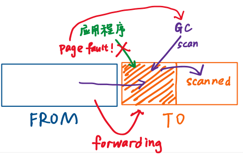

[appel-li.pdf (mit.edu)](https://pdos.csail.mit.edu/6.828/2020/readings/appel-li.pdf)

[==操作系统内核以灵活的方式使用了虚拟内存==](onenote:#Lec08%20Page%20Fault&section-id={7EB9EBCE-898C-462A-BBF8-2771E8E465C5}&page-id={E136E66C-C439-4747-BB20-18063F481801}&end&base-path=https://d.docs.live.net/1f65032c09a11ca3/Documents/yuebaitu%20的笔记本/4各学科/3CS/玥自学/操作系统/lecture%20notes.one)，**用户应用程序**也应该从中获益

- 需要**trap**，使发生在内核中的**page fault**传播到用户空间，在用户空间的**handler**处理，再返回内核
- **Prot1** 降低一个内存page的**accessability**（读写权限）
- 管理多个page的**ProtN**（修改PTE的bit位，需要清除TLB，这很费时，操作N个可以分摊）
- **UnProt** 增加内存page的**accessability**
- 需要能够查看内存page是否**dirty**
- **map2** 应用程序可以将一个特定的内存地址空间映射两次，且拥有不同的accessability（一份物理地址对应两份虚拟地址）

---

#### 相关系统调用

##### mmap

接收某个对象，将其**映射**到调用者的地址空间

参数：① 想映射到的特定地址；② 地址段长度len；③ Protection bit；④ flags；⑤ 传入的对象；⑥ offset；

可以实现**memory mapped file**（替代read/write系统调用）；可以用于**映射匿名内存**（替代sbrk）

##### mprotect

修改一部分对象的权限

##### munmap

移除映射关系

##### sigaction

一旦特定的**signal**发生，给它传入函数f作为特定signal的**handler**

---

#### 如何支持用户程序

- **Virtual Memory Areas (VMAs) **记录有关**连续内存地址段**（所有page都有相同权限）的信息
  - *e.g.，进程有一个memory mapped file，则有一个VMA与这段地址对应，它包含文件的权限、文件描述符、offset等*

- **User Level Trap**
  - 事件被传到用户空间
  - 通过到用户空间的**upcall**在用户空间运行**handler**
  - **handler**返回到内核代码
  - 内核恢复被中断的进程

---

#### 应用：构建大的缓存表

**缓存表** 将费时的函数运算结果记录，下一次计算时直接表单查找

- 分配一个大的**虚拟地址段**（不分配任何物理内存，只是从**地址空间**获取了很大一段地址
- 查找表单的i槽位，发生**page fault**
- 先给对应的虚拟内存地址分配物理page，然后**计算f(i)**，并**储存结果**
- 恢复程序运行

**page fault handler**需要在消耗完所有表单内存后，**回收**一些page（需要用**Prot1**或**ProtN**减少accessability，从而下次使用时可以**触发page fault**）

---

#### Baker's Real-Time Copying Garbage Collector

**GC** 编程语言替程序员完成内存释放（除C和Rust）

##### copying GC

- 将应用程序申请的内存分为**from空间**和**to空间**
- 程序刚启动时所有内存空闲，应用程序从**from空间**申请内存
- 某时刻**from空间**没有内存空间给新对象了
- **forwarding** 将**仍在使用的对象**拷贝到**to空间**
- 现在**from空间**的所有对象都可以丢弃，成为了**空闲区域**

##### Baker算法

将**forwarding**拆分为**渐进的过程**，应用程序每次调用new申请内存都使得整个拷贝过程向前进一步

注：获取指针指向的对象时（dereference），应检查对象是否在**from空间**，是则将其**forward**（保证在to空间的任何指针指向的都是to空间的对象）

- 每次dereference都需要上述额外步骤，增加了开销
- 不能容易地**并行运行GC**（应用程序和GC **race condition**）

---

#### 使用虚拟内存特性的GC

将**from**和**to**空间都分为**scanned**和**unscanned**两个区域

- 将根节点拷贝到to空间，但其指针还指向**from空间**的对象
- 现在**unscanned**区域包含了所有对象，将其权限设为**none**
- 应用程序第一次使用根节点会发生**page fault**（因为权限是none）
- **page fault handler**中，**GC**扫描**to空间unscanned区域**的所有对象，将它们指向的对象**forward**到**to空间的unscanned区域**，而已被扫描的对象被标记为**scanned**
- 现在应用程序可以访问根节点了（因为它的指针指向位于to空间的对象了）

好处：仍然是**incremental**；不需要额外检查指针；简化了GC的并发（GC可以遍历未被扫描的page，而这些page的权限是none，所以应用程序不能访问）

*然而为什么unscanned page的权限是none，GC也可以访问呢？——使用**map2***

映射两次：一次给**应用程序**，一次给**GC**；对GC而言，unscanned区域也是accessible的

  应用程序和GC拥有相同的page table，它们只是将物理内存映射到**地址空间的两个位置**，也就是page table的两个位置；在一个位置，PTE被标记为**invalid**；在另一个位置，PTE被标记为**可读写**

  

---

[代码展示](https://mit-public-courses-cn-translatio.gitbook.io/mit6-s081/lec17-virtual-memory-for-applications-frans/17.7-shi-yong-xu-ni-nei-cun-te-xing-de-gc-dai-ma-zhan-shi)

