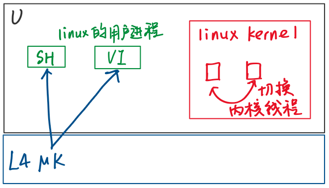

#### Monolithic kernel

linux, unix, xv6

提供**功能强大的抽象**

- 这些高度抽象的接口通常**可移植**
- 向应用程序**隐藏复杂性**
- 帮助管理**共享资源**
- 文件系统、内存分配、调度器、虚拟内存系统都**集成在一个巨大的程序里**
- 所有内核代码以**最大权限**运行

缺点：大且复杂；倾向于拥有所有功能，有大量内容**不必需**；削弱了复杂的抽象能力；**可扩展性**差

---

#### Micro kernel

实现**IPC（Inter-Process Communication）**、**线程**、**任务**的**tiny kernel**

文件系统、设备驱动、网络协议栈等以**普通用户进程**在用户空间运行

- 更**安全**（代码越少，bug越少，利用bug破坏安全性的可能越小）
- 易**优化**（少量代码）
- 运行更**快**
- 给应用程序提供了更多**灵活性**
- **模块化**（将内核拆分，在用户空间的不同部分运行）
- 可以在微内核上**模拟或运行多个操作系统**

---

#### L4 Micro kernel

[microkernel](https://pdos.csail.mit.edu/6.828/2020/readings/microkernel.pdf)

- 只有**7个系统调用**，13000行代码
  - **Threadcreate** 接收一个地址空间ID以创建新线程
  - **Send/Recv IPC**
  - **Mapping** 映射内存page到当前task或其他task的地址空间

- 只包含**非常基础的抽象**
  - **Task** 对应linux的进程，包含**地址空间**和多个**线程**
    - **pager** 内核将**page fault**转换成**IPC消息**发送给对应task指定的pager task（相当于handler）
  - **IPC** 每个线程有一个标识符，用于communicate

---

#### Improving IPC

[Improving IPC](https://www.cse.unsw.edu.au/~cs9242/19/papers/Liedtke_93.pdf)

e.g.，进程P1想给P2发消息

##### 异步buffered

- 使用**send**系统调用，传入dst线程的ID、消息的指针
- 系统调用跳入内核，将消息送入**缓存**（假设P2在做其他事情），并返回
- P2可以接收消息了，调用**recv**系统调用，将消息从内核拷贝到P2的内存，并返回src线程的ID

*假如P1要完成一次完整的消息发送和接收*

- P1调用**send**返回以后，立刻调用**recv**，等待接收消息的buffer出现数据，同时P1出让CPU
- P2调用**recv**拷贝消息，再调用**send**回复消息，同时出让CPU
- P1恢复运行，发现接收消息的buffer有了一条消息，返回到用户空间的P1进程

一共4次系统调用（2个send，2个recv），对应8次用户空间—内核空间切换；recv时需要sleep以等待数据；需要线程调度 & context switching从P1切换到P2

##### Improving

- **synchronized** P1的**send**等待P2的**recv**，当P2因为调用recv进入内核，P1在内核中执行send可以**直接跳回P2的用户空间**，不需要context switching & 线程调度（**unbuffered**）
- send和recv都在内核时，内核直接将消息**从P1的用户空间拷贝到P2的用户空间**（在这个时间点，我们知道收发两端的数据内存地址）
- 如果消息很小，可以通过**寄存器传递**，不需拷贝；P1进入内核时将消息**存放到特定寄存器**，当recv从内核返回P2的用户空间时，会恢复已保存的寄存器，**特定寄存器的内容就是消息的内容**
- 如果消息很长，可以在IPC消息中携带**page映射**，直接将page映射到目标task的地址空间（**调整目标task的page table**即可）
- 对于**RPC**（有request & response），有**call系统调用，**在消息接收端有**sendrecv系统调用**：发送一个回复 + 等待接收下一个request，减少一半的内核—用户态切换

---

#### Run Linux on top of L4 Micro kernel

- 将linux内核作为一个**L4 task**运行，每一个linux进程又作为一个独立的L4 task
- linux不直接修改进程的page table，而是向L4发送**IPC**，让L4来修改
- linux进程包含一个**库**，将linux本身的**系统调用转换成发送到linux task的IPC消息**

问题：linux task会像正常的linuc一样，在不同的内核线程之间切换；然而task的运行由L4决定；因此活跃的内核线程和用户进程无法一一对应，**linux失去了调度能力，所有task都由L4调度**

